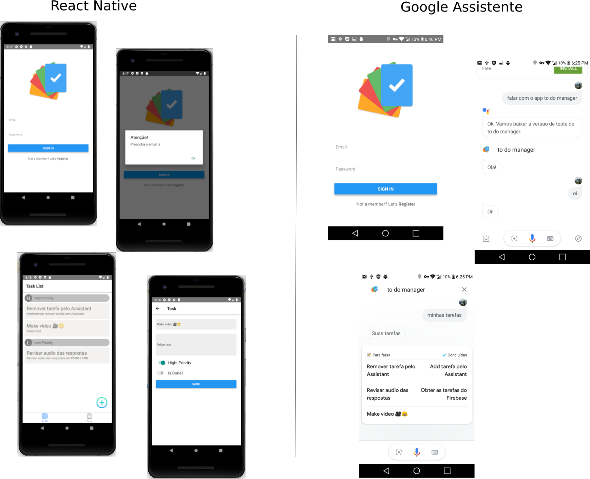

# To Do Manager

To Do Manager é um aplicativo para organizar suas tarefas.

Projeto para estudo do React Native com integração ao Firebase

### Integrações
  - Firebase (auth e database)
  - Google Assistente



### Installation

```sh
$ react-native init seuProjeto
$ cd seuProjeto
$ npm install native-base
$ react-native link native-base
$ react-native run-android ou react-native run-ios
$ react-native start
```

Variáveis do Firebase...

No arquivo **FirebaseApi.js** adicione os dados da sua api

```
const config = {
    apiKey: "...",
    authDomain: "...",
    databaseURL: "...",
    projectId: "...",
    storageBucket: "...",
    messagingSenderId: "..."
};
```

Essas informações estão disponíveis na pagina de configurações do seu projeto Firebase.


Obs app.: Antes de rodar o comando react-native run-android, você precisa ter o emulador do Android rodando com o AVD (Android Video Device). Ou celular em debug conectado.

Obs google assistant: Habilite o modo de teste e no celular diga: Falar com o app to do manager